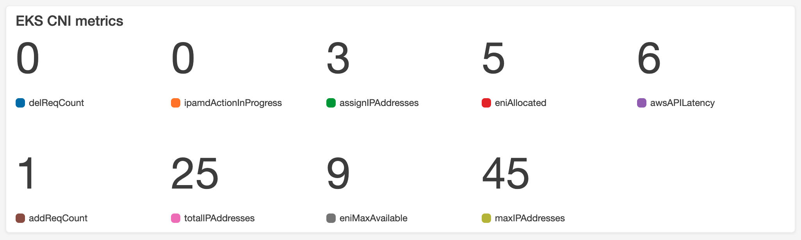

# cni-metrics-helper

The `cni-metrics-helper` is a tool that can be used to scrape ENI and IP information, aggregate it on a cluster 
level and publish the metrics to CloudWatch. The following IAM permission is required by the worker nodes to 
publish metrics:
```
"cloudwatch:PutMetricData"
```
By default, IPAM will publish prometheus metrics on `:61678/metrics`.

The following diagram shows how `cni-metrics-helper` works in a cluster:


As you can see in the diagram, the `cni-metrics-helper` connects to the API Server over https (`tcp/443`), and another connection is created from the API Server to the worker node over http (`tcp/61678`). If you deploy Amazon EKS with the recommended security groups from [Restricting cluster traffic](https://docs.aws.amazon.com/eks/latest/userguide/sec-group-reqs.html#security-group-restricting-cluster-traffic), then make sure that a security group is in place that allows the inbound connection from the API Server to the worker nodes over `tcp/61678`.

Adding the CNI metrics helper will publish the following metrics to CloudWatch:

| Metric | Description | Statistic[^1] |
| ------ | ----------- | ------------- |
| addReqCount | The number of CNI ADD requests that require an IP address | Sum |
| assignIPAddresses |  The number of IP addresses assigned to pods | Sum |
| awsAPIErr | The number of times AWS API returns an error | Sum |
| awsAPILatency | AWS API call latency in ms | Max |
| awsUtilErr | The number of errors not handled in awsutils library | Sum |
| delReqCount | The number of CNI DEL requests | Sum |
| eniAllocated | The number of ENIs allocated | Sum |
| eniMaxAvailable | The maximum number of ENIs that can be attached to this instance, accounting for unmanaged ENIs | Sum |
| ipamdActionInProgress | The number of ipamd actions in progress | Sum |
| ipamdErr | The number of errors encountered in ipamd | Sum |
| maxIPAddresses | The maximum number of IP addresses that can be allocated to the instance | Sum | 
| podENIErr | The number of errors encountered while managing ENIs for pods | Sum |
| reconcileCount | The number of times ipamd reconciles on ENIs and IP/Prefix addresses | Sum |
| totalIPAddresses | The number of IPs allocated for pods | Sum |
| totalIPv4Prefixes | The total number of IPv4 prefixes | Sum |
| totalAssignedIPv4sPerCidr | The total number of IP addresses assigned per cidr | Sum |
| forceRemoveENI | The number of ENIs force removed while they had assigned pods | Sum |
| forceRemoveIPs | The number of IPs force removed while they had assigned pods | Sum |
| ec2ApiReqCount | The number of requests made to EC2 APIs by CNI | Sum |
| ec2ApiErrCount | The number of failed EC2 API requests | Sum |

[^1]: This column indicates how the metric has been aggregated across all nodes
  Sum: For datapoints from all nodes, this is the summation of those datapoints
  Max: For datapoints from all nodes, this is the maximum value of those datapoints

## Using IRSA
As per [AWS EKS Security Best Practice](https://docs.aws.amazon.com/eks/latest/userguide/best-practices-security.html), if you are using IRSA for pods then following requirements must be satisfied to succesfully publish metrics to CloudWatch

1. The IAM Role for your SA [(IRSA)](https://docs.aws.amazon.com/eks/latest/userguide/iam-roles-for-service-accounts.html) must have following policy attached

```
{
    "Version": "2012-10-17",
    "Statement": [
        {
            "Effect": "Allow",
            "Action": [
                "cloudwatch:PutMetricData"
            ],
            "Resource": "*"
        }
    ]
}
```

2. Specify the IRSA name in the cni-metrics-helper deployment spec alongwith the AWS_CLUSTER_ID (as described below). The value that you specify here will show up under the dimension 'CLUSTER_ID' for your published metrics. Specifying a value for this field is mandatory only if you are blocking IMDS access.

### `AWS_CLUSTER_ID`

Type: String

Default: `""`

An identifier for your Cluster which will be used as the dimension for published metrics. Ideally it should be ClusterName or ClusterID.

```
kind: Deployment
apiVersion: apps/v1
metadata:
  name: cni-metrics-helper
  namespace: kube-system
  labels:
    k8s-app: cni-metrics-helper
spec:
  selector:
    matchLabels:
      k8s-app: cni-metrics-helper
  template:
    metadata:
      labels:
        k8s-app: cni-metrics-helper
    spec:
      containers:
      - env:
        - name: AWS_CLUSTER_ID
          value: ""  
        - name: USE_CLOUDWATCH
          value: "true"
        name: cni-metrics-helper
        image: <image>
      serviceAccountName: <IRSA name>
```
With IRSA, the above deployment spec will be auto-injected with AWS_REGION parameter, and it will be used to fetch region information when we publish metrics. 
Possible scenarios for above configuration:
1. If you are not using IRSA, then Region and CLUSTER_ID information will be fetched using IMDS (should have access)
2. If you are using IRSA but have not specified AWS_CLUSTER_ID, we will fetch the value for CLUSTER_ID if IMDS access is not blocked
3. If you have blocked IMDS access, then you must specify a value for AWS_CLUSTER_ID in the deployment spec
4. If you have not blocked IMDS access but have specified AWS_CLUSTER_ID value, then this value will be used. 

## Installing the cni-metrics-helper

To install the CNI metrics helper, follow the installation instructions from the target version [release notes](https://github.com/aws/amazon-vpc-cni-k8s/releases).

## Creating a metrics dashboard

After you have deployed the CNI metrics helper, you can view the CNI metrics in the Amazon CloudWatch console.

**To create a CNI metrics dashboard**

1. Open the CloudWatch console at [https://console.aws.amazon.com/cloudwatch/](https://console.aws.amazon.com/cloudwatch/).
2. In the left navigation pane, choose **Metrics** and then select **All metrics**.
3. Choose the **Graphed metrics** tab.
4. Choose **Add metrics using browse or query**.
5. Make sure that under **Metrics**, you've selected the AWS Region for your cluster.
6. In the Search box, enter **Kubernetes** and then press **Enter**.
7. Select the metrics that you want to add to the dashboard.
8. At the upper right of the console, select **Actions**, and then **Add to dashboard**.
9. In the **Select a dashboard** section, choose **Create new**, enter a name for your dashboard, such as **EKS\-CNI\-metrics**, and then choose **Create**.
10. In the **Widget type** section, select **Number**.
11. In the **Customize widget title** section, enter a logical name for your dashboard title, such as **EKS CNI metrics**.
12. Choose **Add to dashboard** to finish. Now your CNI metrics are added to a dashboard that you can monitor. For more information about Amazon CloudWatch Logs metrics, see [Using Amazon CloudWatch metrics](https://docs.aws.amazon.com/AmazonCloudWatch/latest/monitoring/working_with_metrics.html) in the Amazon CloudWatch User Guide.



## Get cni-metrics-helper logs

```
kubectl get pod -n kube-system
NAME                                  READY     STATUS    RESTARTS   AGE
aws-node-248ns                        1/1       Running   0          6h
aws-node-257bn                        1/1       Running   0          2h
...
cni-metrics-helper-6dcff5ddf4-v5l6d   1/1       Running   0          7h
kube-dns-75fddcb66f-48tzn             3/3       Running   0          1d
```

```
kubectl logs cni-metrics-helper-6dcff5ddf4-v5l6d -n kube-system
```

### cni-metrics-helper key log messages

Example of some aggregated metrics
```
I0516 17:11:58.489648       7 metrics.go:350] Produce GAUGE metrics: ipamdActionInProgress, value: 0.000000
I0516 17:11:58.489657       7 metrics.go:350] Produce GAUGE metrics: assignIPAddresses, value: 2.000000
I0516 17:11:58.489665       7 metrics.go:350] Produce GAUGE metrics: totalIPAddresses, value: 11186.000000
I0516 17:11:58.489674       7 metrics.go:350] Produce GAUGE metrics: eniMaxAvailable, value: 800.000000
I0516 17:11:58.489685       7 metrics.go:340] Produce COUNTER metrics: ipamdErr, value: 1.000000
I0516 17:11:58.489695       7 metrics.go:350] Produce GAUGE metrics: eniAllocated, value: 799.000000
I0516 17:11:58.489715       7 metrics.go:350] Produce GAUGE metrics: maxIPAddresses, value: 11200.000000
```

## How to build

In the base folder of the project:
```
make docker-metrics
```

### To run tests
```
make docker-metrics-test
```
