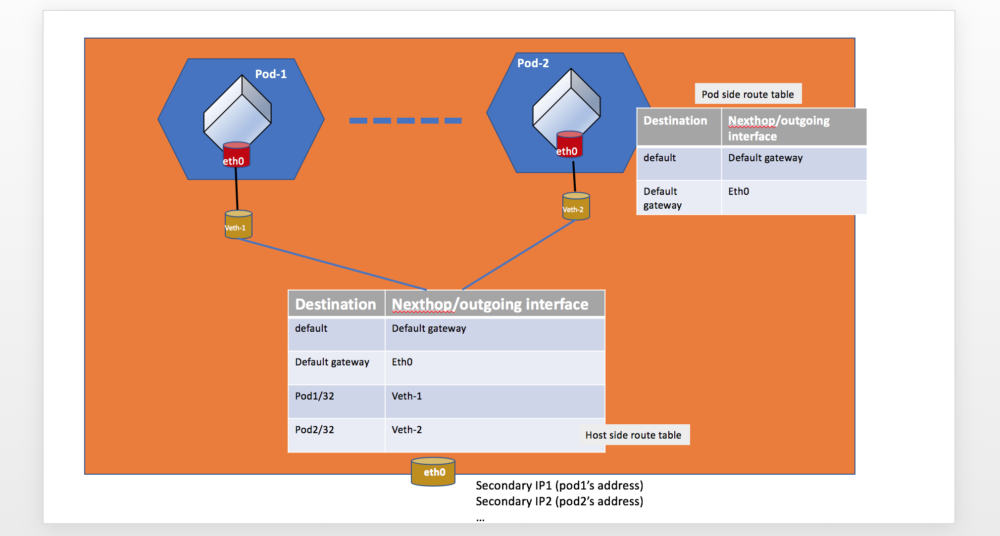
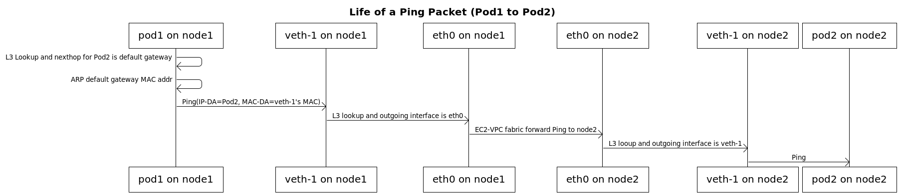
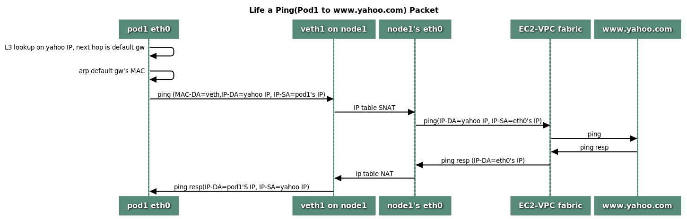
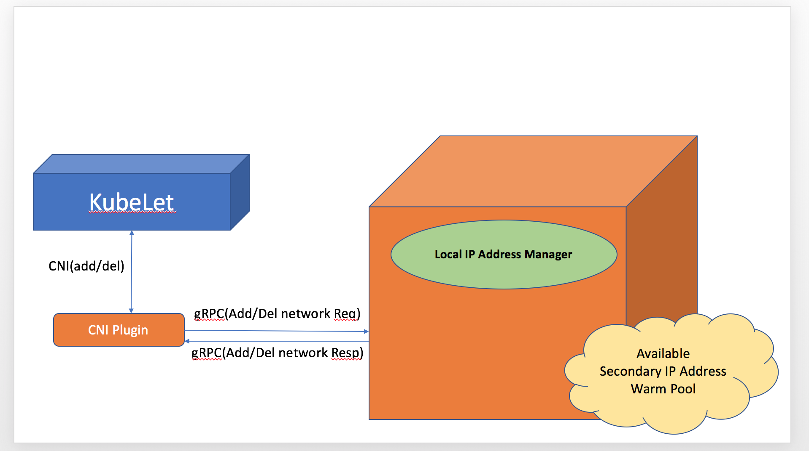

# Proposal: CNI plugin for Kubernetes networking over AWS VPC 

## Background
Kubernetes imposes the following fundamental requirements:

* All containers can communicate with all other containers without NAT
* All nodes can communicate with all containers (and vice-versa) without NAT
* The IP address that a container sees itself as is the same IP address that others see it as

To run Kubernetes over AWS VPC, we would like to reach following additional goals:

* Networking for Pods must support high throughput and availability, low latency and minimal jitter comparable to the characteristics a user would get from EC2 networking.
* Users must be able to express and enforce granular network policies and isolation comparable to those achievable with native EC2 networking and security groups.
* Network operation must be simple and secure. Users must be able to apply existing AWS VPC networking and security best practices for building Kubernetes clusters over AWS VPC. For example, a user should be able to: 
	* use VPC flow logs for troubleshooting and compliance auditing,
	* apply VPC routing polices for traffic engineering,
	* apply security groups to enforce isolation and meet regulatory requirements.
* Pod networking should be setup in a matter of seconds.
* Administrators should be able to scale clusters up to 2000 nodes.
 
## Proposal
Here we propose:

* For each Kubernetes node (ec2 instance), create multiple elastic network interfaces (ENIs) and allocate their secondary IP addresses. 
* For each pod, pick a free secondary IP address, assign it to the pod, wire host and pod networking stack to allow:
	* Pod to Pod on a single host communication
	* Pod to Pod on different hosts communication
	* Pod to other AWS service communication
	* Pod to on-premises data center communication
	* Pod to internet communication

In [EC2-VPC](http://docs.aws.amazon.com/AWSEC2/latest/UserGuide/MultipleIP.html), each instance can have multiple elastic network interfaces (ENI) and each ENI can have multiple IPv4 or IPv6 addresses. Any packet which is destined to one of these addresses, EC2-VPC fabric will deliver the packet to the instance.

An elastic network interface is a virtual network interface that you can attach to an instance in a VPC. When the ENI is attached to an instance, a corresponding interface is created. The primary ENI IP address is automatically assigned to the interface. All secondary addresses remain unassigned and it's up to the host owner as to how to configure them.

### How many addresses are available?
When you create a VPC, you must specify a range of IPv4 addresses for the VPC in the form of a Classless Inter-Domain Routing (CIDR) block; for example, 10.0.0.0/16. This is the primary CIDR block for your VPC.

A VPC spans all the Availability Zones in the region. After creating a VPC, you can add one or more subnets in each Availability Zone. When you create a subnet, you specify the CIDR block for the subnet, which is a subset of the VPC CIDR block. Each subnet must reside entirely within one Availability Zone and cannot span zones. Availability Zones are distinct locations that are engineered to be isolated from failures in other Availability Zones. By launching instances in separate Availability Zones, you can protect your applications from the failure of a single location. We assign a unique ID to each subnet. 

When you create an ENI, you must specify the subnet. Based on the instance type ([Limit](http://docs.aws.amazon.com/AWSEC2/latest/UserGuide/using-eni.html#AvailableIpPerENI)), each instance can have up to N ENIs and M addresses. One address on each ENI is always marked as primary, while others are secondary addresses. The primary IP address is not used by any Pods as it is required for traffic routing between Pods and outside world.

Maximum number of IP addresses available to Pods on each EC2 instance can be calculated as:

Max IPs = min((N * M - N), subnet's free IP)
## Solution Components

### Pod to Pod Communication
Here is an overview on how we setup host side network stack and pod side network stack to allow pod to pod communication:



#### Inside a Pod

 IP address
 
 ```
# ip addr show
1: lo: <LOOPBACK,UP,LOWER_UP> mtu 65536 qdisc noqueue state UNKNOWN qlen 1
    link/loopback 00:00:00:00:00:00 brd 00:00:00:00:00:00
    inet 127.0.0.1/8 scope host lo
       valid_lft forever preferred_lft forever
    inet6 ::1/128 scope host 
       valid_lft forever preferred_lft forever
3: eth0@if231: <BROADCAST,MULTICAST,UP,LOWER_UP,M-DOWN> mtu 1500 qdisc noqueue state UP 
    link/ether 56:41:95:26:17:41 brd ff:ff:ff:ff:ff:ff
    inet 10.0.97.30/32 brd 10.0.97.226 scope global eth0 <<<<<<< ENI's secondary IP address
       valid_lft forever preferred_lft forever
    inet6 fe80::5441:95ff:fe26:1741/64 scope link 
       valid_lft forever preferred_lft forever
 ```
 
 routes
 
 ```
 # ip route show
default via 169.254.1.1 dev eth0 
169.254.1.1 dev eth0 
 ```
 
 static arp
 
 ```
 # arp -a
? (169.254.1.1) at 2a:09:74:cd:c4:62 [ether] PERM on eth0
 ```
 
#### On Host side

There are multiple routing tables used to route incoming/outgoing Pod's traffic.

* main (toPod) route table is used to route to Pod traffic

```
# ip route show
default via 10.0.96.1 dev eth0 
10.0.96.0/19 dev eth0  proto kernel  scope link  src 10.0.104.183 
10.0.97.30 dev aws8db0408c9a8  scope link  <------------------------Pod's IP
10.0.97.159 dev awsbcd978401eb  scope link 
10.0.97.226 dev awsc2f87dc4cdd  scope link 
10.0.102.98 dev aws4914061689b  scope link 
...
```

* Each ENI has its own route table which is used to route pod's outgoing traffic,  where pod is allocated with one of the ENI's secondary IP address

```
# ip route show table eni-1
default via 10.0.96.1 dev eth1 
10.0.96.1 dev eth1  scope link 
```

* Here is the routing rules to enforce policy routing

```
# ip rule list
0:	from all lookup local 
512:	from all to 10.0.97.30 lookup main <---------- to Pod's traffic
1025:	not from all to 10.0.0.0/16 lookup main 
1536:	from 10.0.97.30 lookup eni-1 <-------------- from Pod's traffic
```


#### CNI Plugin Sequence
Here are the wiring steps to enable pod to pod communication:

* Get a Secondary IP address assigned to the instance by L-IPAMD

* Create a veth pair and have one veth on host namespace and one veth on Pod's namespace

	```
	ip link add veth-1 type veth peer name veth-1c  /* on host namespace */
	ip link set veth-1c netns ns1  /* move veth-1c to Pod's namespace ns1 */
	ip link set veth-1 up /* bring up veth-1 */
	ip netns exec ns1 ip link set veth-1c up /* bring up veth-1c */
	```

* Perform following inside Pod's name space:
	* Assign the IP address to Pod's eth0
	* Add default gateway and default route to Pod's route table
	* Add a static ARP entry for default gateway

	```
	/* To assign IP address 20.0.49.215 to Pod's namespace ns1 */
	ip netns exec ns1 ip addr add 20.0.49.215/32 dev veth-1c /* assign a IP address to veth-1c */
	ip netns exec ns1 ip route add 169.254.1.1 dev veth-1c /* add default gateway */ 
	ip netns exec ns1 ip route add default via 169.254.1.1 dev veth-1c /* add default route */

	ip netns exec ns1 arp -i veth-1c -s 169.254.1.1 <veth-1's mac> /* add static ARP entry for default gateway */
	```

* On host side, add host route so that incoming Pod's traffic can be routed to Pod.

	```
	/* Pod's IP address is 20.0.49.215 */
	ip route add 20.0.49.215/32 dev veth-1 /* add host route */
	```

#### Life of a Pod to Pod Ping Packet



### Pod to external communications
For Pod to external (outside VPC) traffic, we will program iptables to SNAT using Primary IP address on the Primary ENI.

Here is the NAT rule:

```
-A POSTROUTING ! -d <VPC-CIDR> -m comment --comment "kubenetes: SNAT for outbound traffic from cluster" -m addrtype ! --dst-type LOCAL -j SNAT --to-source <Primary IP on the Primary ENI>
```

#### Life of a Pod to External Packet



### Local IP Address Manager (L-IPAM)

For fast Pod networking setup time, we will run a small, single binary(L-IPAM) on each host to maintain a warm-pool of available secondary IP addresses. Whenever Kubelet receives an ADD pod request, L-IPAM can immediately take one available secondary IP address from its warm pool and assign it to Pod.

#### Building a warm-pool of available secondary IP addresses
L-IPAM learns the available ENIs and their secondary IP addresses from [EC2 instance's Metadata Service](http://docs.aws.amazon.com/AWSEC2/latest/UserGuide/ec2-instance-metadata.html). 

```
// retrieve all attached ENIs
curl http://169.254.169.254/latest/meta-data/network/interfaces/macs/

// retrieve all IPv4 addresses on an ENI
curl http://169.254.169.254/latest/meta-data/network/interfaces/macs/0a:da:9d:51:47:28/local-ipv4s
```

Whenever L-IPAM daemon restarts (e.g. for upgrade reason), it also queries local Kubelet introspection service to get current running Pods information such as Pod Name, Pod Namespace and Pod IP address.

```
kubectl get --raw=/api/v1/pods 
```
With the information from these 2 sources, L-IPAM can build a warm-pool that contains all available secondary IP addresses on the instance.

#### Maintaining the warm-pool of available secondary IP addresses

L-IPAM monitors the size of secondary IP address warm pool.

* whenever the number of available IP addresses goes below a configured min threshold, L-IPAM  will:
	* create a new ENI and attach it to instance
	* allocate all available IP addresses on this new ENI
	* once these IP addresses become available on the instance (confirmed through instance's metadata service), add these IP addresses to warm-pool.

* whenever the number of available IP addresses exceeds a configured max threshold, L-IPAM will pick an ENI where all of its secondary IP address are in warm-pool, detach the ENI interface and free it to EC2-VPC ENI pool. 

##### Note
Fragmentation of addresses assignment to ENIs may prevent freeing ENIs even when there are many unused IP addresses.

##### Limitations and Security Consideration
Right now, ENIs are allocated or freed by L-IPAM on each instance.  All ENIs on a instance share same subnet and same security groups.

#### Pod IP address cooling period

When a Pod is deleted, we will keep the Pod IP address in "cooling mode" for cooling period. When the cooling period expires, we will return this Pod IP to the warm-pool. The cooling period is used to prevent CNI plugin recycle this Pod's IP address and assign to a new Pod before controller has finished updating all nodes in the cluster about this deleted pod.

#### Troubleshooting

L-IPAM will have a command to show:

* Number of currently allocated IP addresses
* How many addresses are still available
* Detail information of each allocated IP address, such as pod name and namespace

```
curl http://localhost:6666/ip-manager
```

### Inter-process communication  between CNI-plugin and L-IPAM

We will use gRPC for inter-process communication between CNI-plugin and L-IPAM.



### Installation
L-IPAM runs as DaemonSet on all nodes.
### Future

In the future, we would like to investigate whether to have a cluster ENI manager which manages allocating and freeing ENIs for all worker nodes in the cluster.  Here are a few benefits of having a cluster ENI manager:

* Administrators can remove EC2 ENI write permission from worker nodes.
* It may be easier to troubleshoot.
* It may be easier to allow ENIs of different security groups and subnets get attached to a single worker node.
