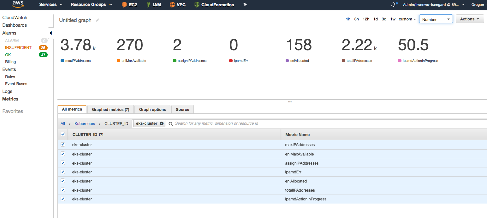

# Troubleshooting Tips


## Manage Pod's IP address pool at cluster level
As described in [Proposal: CNI plugin for Kubernetes networking over AWS VPC](./cni-proposal.md), ipamD allocates ENIs and 
secondary IP addresses from the instance subnet.

A node, based on the instance type [limit](http://docs.aws.amazon.com/AWSEC2/latest/UserGuide/using-eni.html#AvailableIpPerENI), 
can have up to `N` ENIs and `M` addresses. The maximum number of IP addresses available to pods on this node is 
`min((N * (M - 1)), free IPs in the subnet)`. The `-1` is because each ENI uses one of the IPs when it is attached to the instance.

### Tip: Make sure subnet have enough available addresses
If a subnet runs out of IP addresses, ipamD will not able to get secondary IP addresses. When this happens, pods assigned 
to this node may not able to get an IP and get stuck in **ContainerCreating**.

You can check the available IP addresses in AWS console:


#### Possible issue: 
[Leaking ENIs](https://github.com/aws/amazon-vpc-cni-k8s/issues/69) can cause a subnet available IP pool being depleted 
and requires user intervention.

### Tip: Make sure there are enough ENIs and IPs for Pods in the cluster

We provide a tool [**cni-metrics-helper**](../config/v1.4/cni-metrics-helper.yaml) which can show aggregated ENI and IP 
information at the cluster level.

By default these metrics will be pushed to CloudWatch, but it can be disabled by setting `USE_CLOUDWATCH` to `"no"`. 
This requires the `"cloudwatch:PutMetricData"` permission to publish the metrics. 

Example of CNI metrics in CloudWatch:


**maxIPAddress**: the maximum number of IP addresses that can be used for Pods in the cluster. (assumes there is enough IPs in the subnet).

**totalIPAddresses**: the total number of secondary IP addresses attached to the instances in the cluster.

**assignIPAddresses**: the total number of IP addresses already assigned to Pods in cluster.

If you need to deploy more Pods than **maxIPAddresses**, you need to increase your cluster and add more nodes.

### Tip: Running Large cluster
When running 500 nodes cluster, we noticed that when there is a burst of pod scale up event (e.g. scale pods from 0 to 23000)
at onetime, it can trigger all node's ipamD start allocating ENIs. Due to EC2 resource limit nature, some node's ipamD can get
throttled and go into exponentially backoff before retry. If a pod is assigned to this node and its ipamD is waiting to retry,
the pod could stay in **ContainerCreating** until ENI retry succeed.

You can verify if you are in this situation by running the cni-metrics-helper:



**ipamdActionInProgress**: the total number of nodes whose ipamD is in the middle of ENI operation.

To avoid Pod deployment delay, you can configure ipamD to have a higher [**WARM\_ENI\_TARGET**](https://github.com/aws/amazon-vpc-cni-k8s/pull/68).

### Tip: Running CNI on non-EKS AMI
If ping between pods are not working, please make sure to check if FORWARD policy is set to ACCEPT since by default in iptables it is set to DROP. With EKS AMI, the policy is updated to set ACCEPT in [kubelet.service](https://github.com/awslabs/amazon-eks-ami/blob/master/files/kubelet.service#L8). Please ref: https://github.com/aws/amazon-vpc-cni-k8s/pull/535 and https://github.com/awslabs/amazon-eks-ami/issues/332 for more details.

## Troubleshooting CNI/ipamD at node level

### debugging logs are stored in
```
/var/log/aws-routed-eni
[ec2-user@ip-192-168-188-7 aws-routed-eni]$ ls 
ipamd.log.2018-05-15-21  ipamd.log.2018-05-16-02  ipamd.log.2018-05-16-07  ipamd.log.2018-05-16-12  ipamd.log.2018-05-16-17  plugin.log.2018-05-16-00  plugin.log.2018-05-16-19
ipamd.log.2018-05-15-22  ipamd.log.2018-05-16-03  ipamd.log.2018-05-16-08  ipamd.log.2018-05-16-13  ipamd.log.2018-05-16-18  plugin.log.2018-05-16-02
ipamd.log.2018-05-15-23  ipamd.log.2018-05-16-04  ipamd.log.2018-05-16-09  ipamd.log.2018-05-16-14  ipamd.log.2018-05-16-19  plugin.log.2018-05-16-03
ipamd.log.2018-05-16-00  ipamd.log.2018-05-16-05  ipamd.log.2018-05-16-10  ipamd.log.2018-05-16-15  ipamd.log.2018-05-16-20  plugin.log.2018-05-16-04
ipamd.log.2018-05-16-01  ipamd.log.2018-05-16-06  ipamd.log.2018-05-16-11  ipamd.log.2018-05-16-16  ipamd.log.2018-05-16-21  plugin.log.2018-05-16-14
[ec2-user@ip-192-168-188-7 aws-routed-eni]$ 
```

### collecting node level tech-support bundle for offline troubleshooting

```
[root@ip-192-168-188-7 aws-routed-eni]# /opt/cni/bin/aws-cni-support.sh

// download
/var/log/eks_i-01111ad54b6cfaa19_2020-03-11_0103-UTC_0.6.0.tar.gz
```

### ipamD debugging commands

```
// get enis info
[root@ip-192-168-188-7 bin]# curl http://localhost:61679/v1/enis | python -m json.tool
  % Total    % Received % Xferd  Average Speed   Time    Time     Time  Current
                                 Dload  Upload   Total   Spent    Left  Speed
100  2589    0  2589    0     0   2589      0 --:--:-- --:--:-- --:--:--  505k
{
    "AssignedIPs": 46,  
    "ENIIPPools": {
        "eni-0248f7351c1dab6b4": {
            "AssignedIPv4Addresses": 14,
            "DeviceNumber": 2,
            "IPv4Addresses": {
                "192.168.134.93": {
                    "Assigned": true
                },
                "192.168.135.243": {
                    "Assigned": true
                },
                "192.168.137.75": {
                    "Assigned": true
                },
                "192.168.141.97": {
                    "Assigned": true
                },
                "192.168.143.223": {
                    "Assigned": true
                },
                "192.168.154.40": {
                    "Assigned": true
                },
                "192.168.161.99": {
                    "Assigned": true

...
                   "Assigned": false
                },
                "192.168.177.82": {
                    "Assigned": true
                },
                "192.168.179.236": {
                    "Assigned": false
                },
                "192.168.184.253": {
                    "Assigned": false
                }
            },
            "Id": "eni-0ebff0ef030f81d5c",
            "IsPrimary": false
        }
    },
    "TotalIPs": 56
}
```

```
// get IP assignment info
[root@ip-192-168-188-7 bin]# curl http://localhost:61679/v1/pods | python -m json.tool
  % Total    % Received % Xferd  Average Speed   Time    Time     Time  Current
                                 Dload  Upload   Total   Spent    Left  Speed
100  6688    0  6688    0     0   6688      0 --:--:-- --:--:-- --:--:-- 1306k
{
    "cni-metrics-helper-6dcff5ddf4-v5l6d_kube-system_": {
        "DeviceNumber": 0,
        "IP": "192.168.181.95"
    },
    "worker-hello-5974f49799-2hkc4_default_f7dba23f452c4c7fc5d51344aeadf82922e40b838ffb5f13b057038f74928a31": {
        "DeviceNumber": 0,
        "IP": "192.168.135.154"
    },
    "worker-hello-5974f49799-4fj9p_default_40faa88f59f73e38c3f791f3c3208240a00b49dcad406d5edbb2c8c87ed9dd36": {
        "DeviceNumber": 3,
        "IP": "192.168.164.251"
    },
    "worker-hello-5974f49799-4wh62_default_424f0d03175c2d62817aad1810413873703ca00251284646ed5dae60fdbc447f": {
        "DeviceNumber": 2,
        "IP": "192.168.179.14"
    },
...
}
```

```
// get ipamD metrics
root@ip-192-168-188-7 bin]# curl http://localhost:61678/metrics
# HELP awscni_assigned_ip_addresses The number of IP addresses assigned
# TYPE awscni_assigned_ip_addresses gauge
awscni_assigned_ip_addresses 46
# HELP awscni_eni_allocated The number of ENI allocated
# TYPE awscni_eni_allocated gauge
awscni_eni_allocated 4
# HELP awscni_eni_max The number of maximum ENIs can be attached to the instance
# TYPE awscni_eni_max gauge
awscni_eni_max 4
# HELP go_gc_duration_seconds A summary of the GC invocation durations.
# TYPE go_gc_duration_seconds summary
go_gc_duration_seconds{quantile="0"} 5.6955e-05
go_gc_duration_seconds{quantile="0.25"} 9.5069e-05
go_gc_duration_seconds{quantile="0.5"} 0.000120296
go_gc_duration_seconds{quantile="0.75"} 0.000265345
go_gc_duration_seconds{quantile="1"} 0.000560554
go_gc_duration_seconds_sum 0.03659199
go_gc_duration_seconds_count 211
# HELP go_goroutines Number of goroutines that currently exist.
# TYPE go_goroutines gauge
go_goroutines 20
...
```

## IMDS

If you're using v1.10.0, `aws-node` daemonset pod requires IMDSv1 access to obtain Primary IPv4 address assigned to the Node. Please refer to `Block access to IMDSv1 and IMDSv2 for all containers that don't use host networking` section in this [doc](https://docs.aws.amazon.com/eks/latest/userguide/best-practices-security.html) 

## Known Issues
- **Liveness/Readiness Probe failures** - If frequent probe failures are observed for `aws-node` pods in v1.20+ clusters, please bump up the liveness/readiness probe timeout values and/or CPU requests/limts in the CNI Manifest. Refer to this github [issue](https://github.com/aws/amazon-vpc-cni-k8s/issues/1425)

- **aws-node crashing with below error** 

```
{"level":"info","ts":"2022-02-04T22:24:55.014Z","caller":"entrypoint.sh","msg":"Checking for IPAM connectivity ... "}
I0204 22:24:56.095582      12 request.go:621] Throttling request took 1.047064274s, request: GET:https://10.100.0.1:443/apis/coordination.k8s.io/v1beta1?timeout=32s
{"level":"info","ts":"2022-02-04T22:24:57.022Z","caller":"entrypoint.sh","msg":"Retrying waiting for IPAM-D"}
panic: runtime error: invalid memory address or nil pointer dereference
[signal SIGSEGV: segmentation violation code=0x1 addr=0x39 pc=0x5597a7c2b3f8]

goroutine 380 [running]:
github.com/aws/amazon-vpc-cni-k8s/pkg/ipamd.(*IPAMContext).StartNodeIPPoolManager(0xc000281560)
    /go/src/github.com/aws/amazon-vpc-cni-k8s/pkg/ipamd/ipamd.go:640 +0x18
created by main._main
    /go/src/github.com/aws/amazon-vpc-cni-k8s/cmd/aws-k8s-agent/main.go:64 +0x2bb
{"level":"info","ts":"2022-02-04T22:24:59.030Z","caller":"entrypoint.sh","msg":"Retrying waiting for IPAM-D"}
```

cni v1.10.x introduced 2 new env variables - ENABLE_IPv4 and ENABLE_IPv6. The above error can be caused if you miss adding these env variables to your cni daemonset. So the recommendation is to apply the entire manifest file corresponding to the correct [release](https://github.com/aws/amazon-vpc-cni-k8s/releases) instead of just updating the image value in existing cni daemonset. For instance, to apply the latest v1.10.x, use the below command
```
kubectl apply -f https://raw.githubusercontent.com/aws/amazon-vpc-cni-k8s/release-1.10/config/master/aws-k8s-cni.yaml
```

## cni-metrics-helper

See the [cni-metrics-helper README](../cmd/cni-metrics-helper/README.md).

